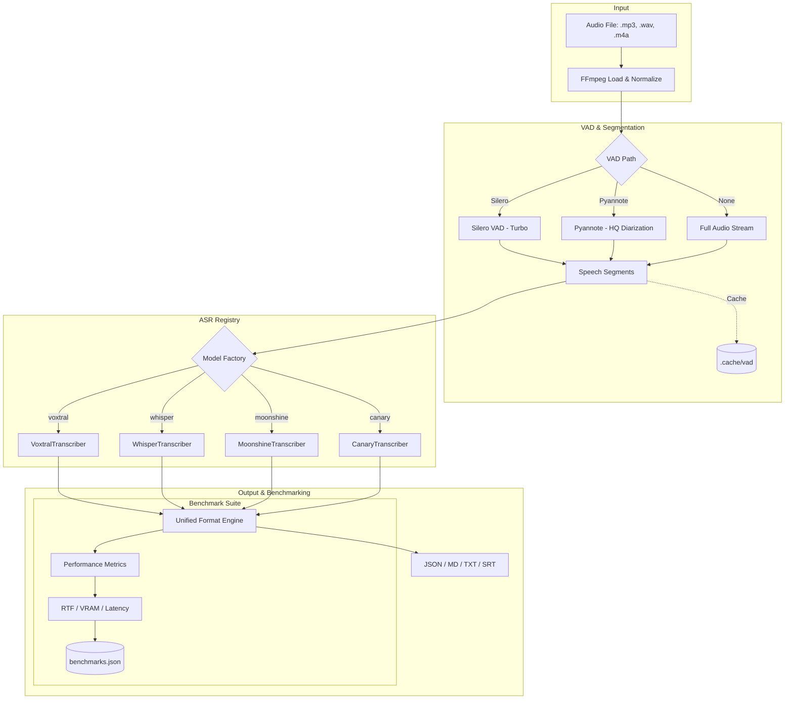

# 🎙️ VoxBench - Multi-Transcribe Explorer

**VoxBench** is a high-performance, unified transcription and benchmarking platform designed to explore and compare state-of-the-art ASR (Automatic Speech Recognition) models. It is optimized for **NVIDIA Blackwell (GB10/GX10)**, CUDA, ROCm, and CPU.

---

## 🎯 Aim of the Project

The primary goal of **Multi-Transcribe** is to provide a standardized environment for evaluating speech-to-text engines. Instead of being locked into a single model, this tool allows researchers and developers to:

1.  **Explore Multi-Model Synergy**: Compare outputs from **Voxtral (Mistral)**, **Whisper (OpenAI)**, **Moonshine**, and **Canary (NVIDIA)** side-by-side.
2.  **Optimize VAD Strategies**: Benchmark lightweight **Silero VAD** against high-accuracy **Pyannote Diarization** to find the perfect speed-to-accuracy balance.
3.  **Performance Profiling**: Use the built-in **Benchmark Mode** to measure **Real-Time Factor (RTF)**, VRAM footprint, and processing latency on elite hardware like the **Asus Ascent GX10**.
4.  **Production-Ready Baseline**: Provide a robust, "Super-Dockerfile" environment that handles complex dependencies (NeMo, Transformers, faster-whisper) out of the box.

---

## 🏗️ Architecture

The project follows a modular, plugin-based architecture where every transcription engine and VAD provider is decoupled via a unified interface.



---

## 🚀 Getting Started (Docker)

### 1. Build the Unified Image
Optimized for **NVIDIA Blackwell (Spark/GX10)** using `uv` for 10x faster builds:
```bash
docker compose build multi-transcribe-spark
```

### 2. Run Transcription
```bash
# Basic transcription (Voxtral + Silero)
docker compose run --rm multi-transcribe-spark /data/audio.mp3

# High-Quality Diarization (Mistral + Pyannote)
docker compose run --rm multi-transcribe-spark /data/meeting.mp3 --vad pyannote --diarize
```

---

## 🔥 Running Benchmarks

### Benchmark Specific Models
You can pass a comma-separated list of models to benchmark them sequentially:
```bash
docker compose run --rm multi-transcribe-spark /data/test.mp3 --model voxtral:mini-4b,whisper:turbo --benchmark
```

### Benchmark EVERYTHING
Use the `all` keyword to iterate through every model in the registry:
```bash
docker compose run --rm multi-transcribe-spark /data/audio.mp3 --model all --benchmark
```

---

## 📊 Supported Models

| Family | Specifier | Backend | Key Strength |
| :--- | :--- | :--- | :--- |
| **Voxtral** | `voxtral:mini-4b`, `voxtral:small-24b` | Transformers | Real-time native support, HQ French/English |
| **Whisper** | `whisper:large-v3`, `whisper:turbo` | faster-whisper | Global benchmark, extreme throughput |
| **Moonshine**| `moonshine:base`, `moonshine:tiny` | Transformers | Ultra-low latency, CPU-efficient |
| **Canary** | `canary:1b` | NeMo | SOTA Accuracy, Multi-task (ASR/AST) |

---

## ⏱️ Benchmark Mode

When `--benchmark` is enabled, the tool logs performance metrics to `outputs/benchmarks.json`.
- **RTF (Real-Time Factor)**: Audio Duration / Processing Time (e.g., `25.0x` means 1 minute of audio is processed in 2.4 seconds).
- **Peak VRAM**: Maximum GPU memory utilized (critical for the 128GB Blackwell unified memory pool).
- **Latency Breakdown**: Time spent on Model Loading vs. VAD vs. Transcription.

---

## 🛠️ Configuration
- `--vad silero`: Fast, lightweight VAD (baseline).
- `--vad pyannote`: High-accuracy segmentation & Diarization.
- `--no-cache`: Disables the VAD segment cache (useful for debugging).
- `--precision [fp16, fp8, q4, q8]`: Quantization options for Voxtral models.

---

## 📂 Project Structure
- `core/registry.py`: Model factory and registry.
- `core/vad.py`: Unified VAD wrapper for Silero/Pyannote.
- `core/cache.py`: Persistent VAD segment caching.
- `core/benchmark.py`: Performance analytics engine.
- `core/transcribe_*.py`: Engine-specific backends.
